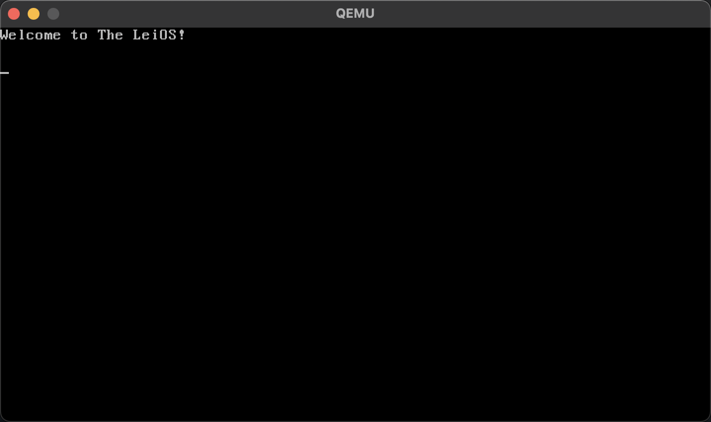

# The LeiOS

学习 C 语言和操作系统，顺便做点有趣的事情。

## 开发环境配置

如果以 macOS 作为开发环境， 构建工具使用 Docker 执行，需要当前系统安装以下工具：

- Docker，用于执行编译构建工具；
- Qemu，用于运行构建好的系统镜像；
- 执行 `make init` 初始化构建环境；
- 执行 `brew install x86_64-elf-gcc` 安装 GCC 编译器；
- 执行 `brew install xorriso` 安装 `xorriso`（`grub-mkrescue` 依赖）；
- 执行 `./install-grub.sh` 构建 `grub-mkrescue`；
- 执行 `brew install gdbgui` 安装一个 GDB GUI 工具，用于可视化调试；

如果以 Linux 作为开发环境，以 Debian/Ubuntu 系统为例，需要执行命令安装必要的工具：

```bash
apt install -y gcc nasm grub2 xorriso
apt install -y qemu-system-x86
```

## 开发过程

- 执行命令 `make kernel` 构建；
- 执行命令 `make run-kernel` 在 QEMU 模拟器中启动；

调试：

- 执行命令 `make run-kernel DEBUG=1` 在 QEMU 模拟器中启动并开启 GDB 调试；
- 执行命令 `gdb` 或 `gdbgui` 连接 GDB 调试，此时会自动在入口 `k_main` 处设置断点；
- GDB 常用命令：
  - `l`：查看当前源码；
  - 设置断点：
    - `b 6`：在当前源码文件的第 `6` 行设置断点；
    - `b main.c:6`：在源码文件 `main.c` 的第 `6` 行设置断点；
    - `b main.c:welcome`：在源码文件 `main.c` 的第 `welcome` 函数设置断点；
    - `tb 6`：在当前源码文件的第 `6` 行设置临时断点，执行后会自动删除；
  - 流程控制：
    - `c`：继续执行；
    - `n`：单步执行；
    - `s`：单步执行（进入子函数）；
    - `info b`：查看断点列表；
    - `d 1`：删除第 `1` 个监视的表达式或断点；
    - `disable 1`：禁用第 `1` 个监视的表达式或断点；
    - `enable 1`：启用第 `1` 个监视的表达式或断点；
    - `u 6`：执行到第 `6` 行处断点；
    - `finish`：一直运行到当前函数返回；
    - `q`：退出调试；
  - 数据观察：
    - `p x`：显示表达式 `x` 的内容；
    - `whatis x`：查看表达式 `x` 的数据类型；
    - `watch x`：监视表达式 `x` 的变化，在执行时会打印该表达式的变化；
    - `info watch`：显示当前的监视列表；
  - `frame 0`：打印第 `0` 层的帧栈信息；
  - `info reg`：打印寄存器信息；
  - `info stack`：打印堆栈信息；

## 截图



## 学习资源

- [intermezzOS - An operating system for learning](https://intermezzos.github.io/book/first-edition/preface.html)
- [Booting into C](https://www.ics.uci.edu/~aburtsev/238P/hw/hw4-boot-into-c/hw4-boot-into-c.html)
- [OS Development Tutorials](http://www.osdever.net/tutorials/index)
- [OS Dev Tutorials](https://wiki.osdev.org/Tutorials)
