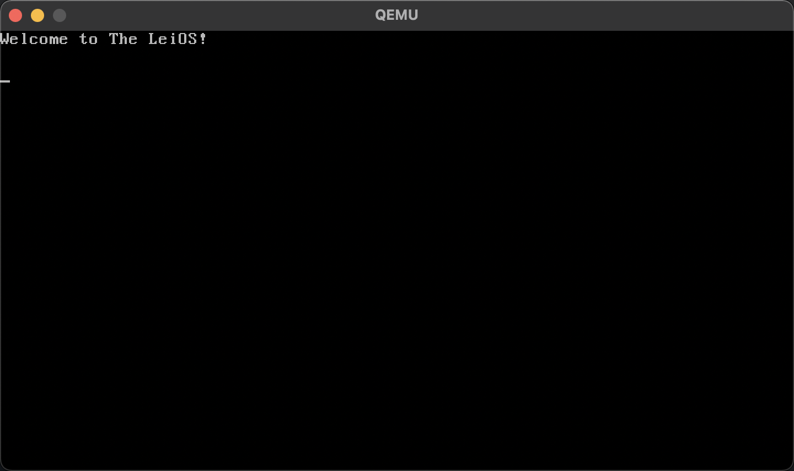

# LeiOS 的 C 语言版本

## 开发环境配置

构建工具使用 Docker 执行，需要当前系统安装以下工具：

- Docker，用于执行编译构建工具；
- Qemu，用于运行构建好的系统镜像；

开发过程：

- 首次开发时，需要执行命令 `./build-docker-image.sh` 构建 Docker 镜像；
- 执行命令 `./build-on-docker.sh` 构建，最终会输出 `target/LeiOS.iso` 的 CDROOM 镜像文件；
- 执行命令 `./run-on-qemu.sh` 用于启动操作系统；

## 截图

