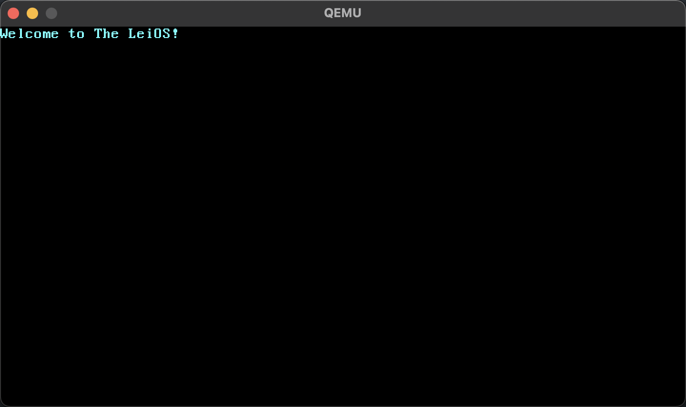

# LeiOS 的 C 语言版本

## 开发环境配置

需要当前系统安装以下工具：

- Rust，用于编译源码；
- Qemu，用于运行构建好的系统镜像；

开发过程：

- 首次开发时，需要执行命令 `./setup.sh` 安装依赖模块；
- 执行命令 `./build.sh` 构建，最终会输出 `target/leios/release/bootimage-leios.bin` 文件；
- 执行命令 `./run-on-qemu.sh` 用于启动操作系统；
- 或者直接执行 `cargo run` 可编译并启动操作系统；

## 截图

